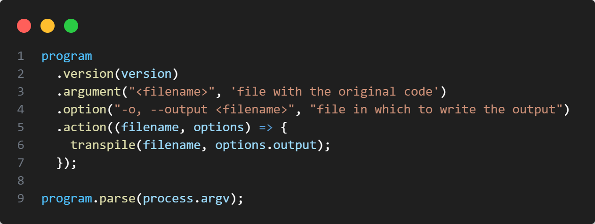
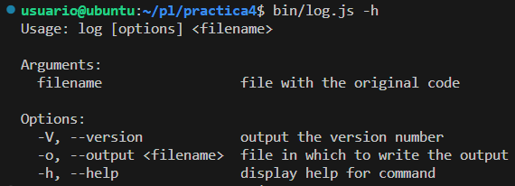
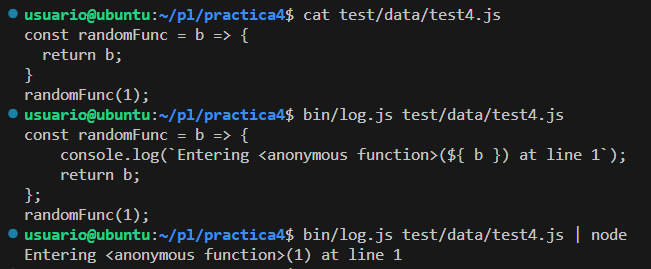
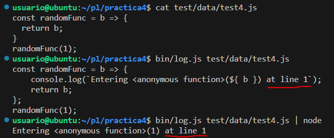
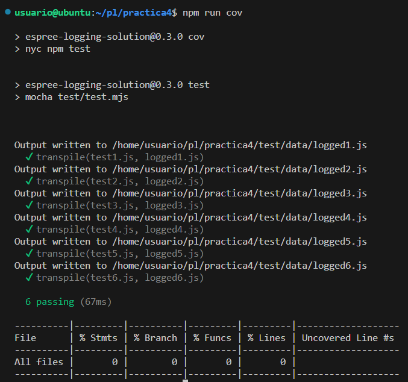

[](https://classroom.github.com/open-in-codespaces?assignment_repo_id=10315187)
# Práctica Espree logging

## Resumen de lo aprendido

Al ejecutar la función addLogging podemos observar que añade un console.log() que muestra el nombre de la función que se está llamando. Esto lo consigue de la siguiente manera:
1. Se genera un AST del código fuente de la función que se le pasa como parámetro.
2. Se recorre el AST en busca de nodos de tipo `FunctionDeclaration` y `FunctionExpression`.
3. Se llama a la función `addBeforeCode()`, a la que se le pasa por parámetros el nodo con la llamada a la función.
4. La función `addBeforeCode()` genera el código del console.log(), lo parsea y lo añade al nodo que se le pasa por parámetros.

## Indicar los valores de los argumentos

Se ha modificado el código de `logging-espree.js` para que el log también indique los valores de los argumentos que se pasaron a la función. 
Ejemplo:

```js
function foo(a, b) {
  var x = 'blah';
  var y = (function (z) {
    return z+3;
  })(2);
}
foo(1, 'wut', 3);
```

```js
function foo(a, b) {
    console.log(`Entering foo(${ a }, ${ b })`);
    var x = 'blah';
    var y = function (z) {
      console.log(`Entering <anonymous function>(${ z })`);
      return z + 3;
    }(2);
}
foo(1, 'wut', 3);
```

## CLI con [Commander.js](https://www.npmjs.com/package/commander)

  
  

## Reto 1: Soportar funciones flecha

1. Añadimos `node.type === 'ArrowFunctionExpression'` a los posibles tipos de nodo que se recorren con `estraverse` en la función `addLogging()`.  
```js	
estraverse.traverse(ast, {
    enter: function(node, parent) {
      if (node.type === 'FunctionDeclaration' ||
        node.type === 'FunctionExpression' ||
        node.type === 'ArrowFunctionExpression') {
        addBeforeCode(node);
      }
    }
  });
```


## Reto 2: Añadir el número de línea

1. Añadimos la propiedad `loc` a `espree.parse()` en la función `addLogging()` para poder obtener la línea de la función.  
```js
  const ast = espree.parse(code, {ecmaVersion:6, loc: true});
```
2. Añadimos la información de `node.loc.start.line` en el `console.log()` generado en la función `addBeforeCode()`.  
```js
const line = node.loc.start.line;
const beforeCode = "console.log(`Entering " + 
  name + "(" + args.join(', ') + ") at line " + line +"`);";
```



## Tests and Covering




[Documentación](https://ull-esit-pl-2223.github.io/espree-logging-miguel-luna-garcia-alu0101448251/)
[Coverage](https://ull-esit-pl-2223.github.io/espree-logging-miguel-luna-garcia-alu0101448251/coverage/)